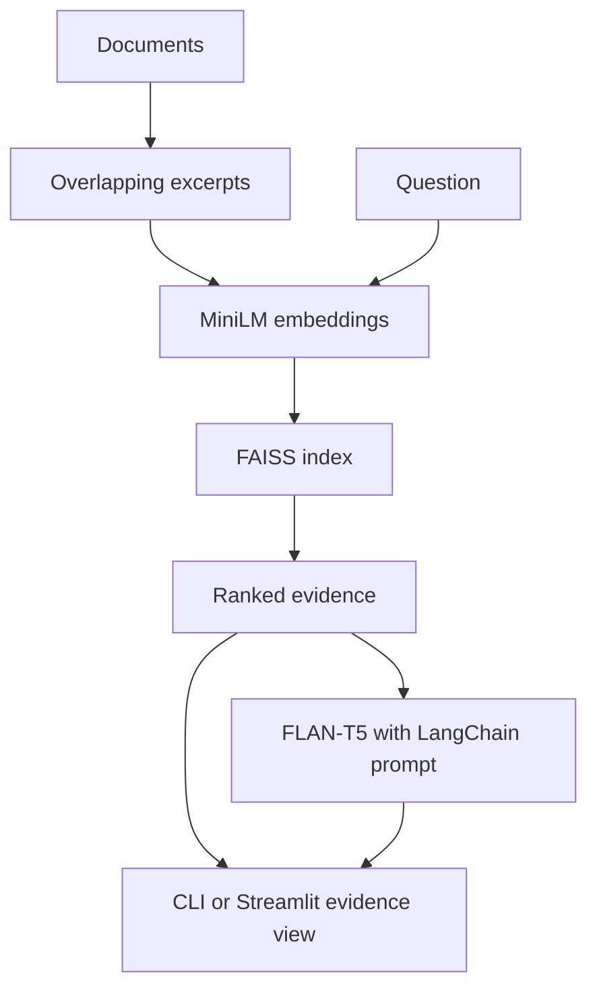

# Engineering Document RAG Chatbot

Rebuilt in October/2026 from my original university project.

This is a new AI-assisted reconstruction based on the project description in my CV, not recovered original source code. It demonstrates semantic retrieval, local language-model answers and inspectable evidence. No historical project results or deployments are claimed.

## What it does

Load UTF-8 `.txt` and `.md` documents, search their meaning, and optionally generate an answer using retrieved excerpts. A Streamlit interface shows the source text and similarity score; a CLI returns structured JSON. Everything runs on your machine after the initial public model downloads. No API key is required.

## Architecture and design choices



- **MiniLM** encodes related phrases into nearby vectors, so retrieval can match meaning rather than exact words.
- **500-character excerpts with 80-character overlap** keep examples small and retain context across boundaries. Source filenames and exact character offsets make retrieval auditable. This simple splitter can cut sentences; more sophisticated splitting is future work.
- **Normalized vectors and FAISS IndexFlatIP** give exact cosine similarity search. Exact search is easy to inspect and sufficient for a small corpus; it does not scale like an approximate index.
- **FLAN-T5-small on CPU** keeps the demo accessible. LangChain composes the prompt with a Hugging Face generation pipeline. Complete excerpts are packed into a conservative 480-token input budget; no silent truncation is used.
- **Native FAISS plus JSON** avoids Python pickle serialization. Only load indexes you built locally; native index files are not safe inputs from strangers. Model revisions are pinned and remote model code execution is disabled.
- **Evidence first**: the UI defaults to search only. Generated answers can be wrong; displayed sources are the context supplied to the model, not proof that every answer statement is supported.

## Tech stack

Python 3.10+, PyTorch, sentence-transformers, Hugging Face Transformers, LangChain, FAISS CPU, Streamlit and pytest. Validated with Python 3.12 on Linux using CPU inference. `requirements-lock.txt` records the exact validation environment (including optional Linux GPU dependencies installed by PyPI); use the main requirements for portable setup.

## Documents, model sources and licenses

The six small documents under `sample_docs/` are newly authored engineering notes licensed under this repository's MIT license. They contain no private records and are not an external benchmark dataset. This project does not train or fine-tune models.

| Component | Public source | License |
|---|---|---|
| Embeddings | [sentence-transformers/all-MiniLM-L6-v2](https://huggingface.co/sentence-transformers/all-MiniLM-L6-v2) | Apache 2.0 |
| Generator | [google/flan-t5-small](https://huggingface.co/google/flan-t5-small) | Apache 2.0 |
| Source code and sample notes | This repository | MIT |

Model weights are downloaded automatically on first use and are not committed. Revisions are recorded in `core.py` and the measured results. See each model card for its upstream training data and limitations; this repository does not claim ownership of those models.

## Setup

From the repository root:

```bash
python -m venv .venv
source .venv/bin/activate
python -m pip install --upgrade pip
# Optional on Linux: avoid downloading CUDA packages for this CPU demo.
python -m pip install torch --index-url https://download.pytorch.org/whl/cpu
python -m pip install -r requirements.txt
python -m pip install -e .
```

On Windows, activate with `.venv\Scripts\activate` and install PyTorch using the official instructions for your platform. Internet access and disk space for the two model downloads are needed initially. Later runs use the Hugging Face cache. No Firebase, cloud credentials or paid service is involved.

## Run

```bash
rag-chat --question "What does an AAAA record contain?" --retrieve-only
rag-chat --question "What does an AAAA record contain?"
streamlit run app.py
```

In the UI, choose **Load documents**, ask a question, and expand the evidence. Uncheck **Search without generating an answer** to load the generator. Conversation turns are displayed, but each question is answered independently; there is no conversational memory or follow-up-question rewriting.

For your own folder:

```bash
rag-chat --docs ./my_docs --index .rag_index --rebuild --question "Your question"
```

Rebuild after changing documents. Without `--rebuild`, the CLI deliberately reuses the saved corpus. The UI reloads the current corpus when **Load documents** is clicked. Files must be UTF-8 text/Markdown and at most 2 MB each. A similarity threshold of 0.25 filters weak matches; it is a heuristic, not a calibrated confidence score. `--top-k` and `--min-score` can be adjusted.

## Reproduce validation

```bash
pytest -q
python scripts/evaluate.py
python scripts/check_ui.py
python -m pip check
```

Validation obtained: **10 pytest tests passed**, the actual-model Streamlit retrieval and generation checks passed, and `pip check` found no broken requirements. Semantic search returned the expected top document for **6 of 6 authored queries**. The generation smoke answer to “What does an AAAA record contain?” was “IPv6.”

`results/smoke.json` contains measured retrieval outputs and one actual generated answer, with model revisions and a corpus fingerprint. The six queries are an authored convenience fixture, not a held-out academic benchmark. There is no train/test split because no model is trained here. Results describe only these sample documents. A successful generation smoke test does not establish answer accuracy.

## Limitations / Future work

- Small local model: answers may omit details, hallucinate or mishandle instructions embedded in documents. The prompt is guidance, not a security boundary.
- Sources show supplied evidence; citations are not automatically verified. Review the excerpts before relying on an answer.
- No PDF/OCR ingestion, authentication, multi-user isolation, streaming, chat memory or production deployment.
- Index writes are not transactional. Rebuild if interrupted; do not share one writable index between processes.
- More meaningful evaluation needs a public QA corpus, independent annotated queries, retrieval metrics and human review of grounded answers.
- Add sentence-aware splitting, reranking, a larger optional generator and incremental indexing after profiling real workloads.
